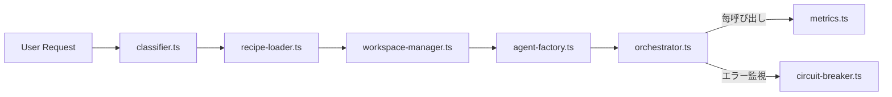

# core/ — オーケストレーション基盤

## 概要

Universal Agent Factory のコア層。ユーザリクエストを受け取ってからプロジェクト生成完了までの全ループを司る。**プロジェクト種別（ゲーム / Web / CLI 等）には依存しない**ことが唯一の設計要件 — 種別固有のロジックは `recipes/<type>/` 側に閉じ込める（R2）。

## アーキテクチャ



## ファイル責務

| ファイル               | 責務                                                                                                                                                                                        |
| ---------------------- | ------------------------------------------------------------------------------------------------------------------------------------------------------------------------------------------- |
| `types.ts`             | 全層共通のインターフェース定義 (Agent, Recipe, ProjectSpec, CommandSpec, Criterion, MetricRecord, …)                                                                                        |
| `orchestrator.ts`      | メインループ (Director → Architect → Scaffold → Programmer → Build → Tester → Reviewer → Evaluator) / REPORT 出力                                                                           |
| `classifier.ts`        | 自然言語リクエスト → `ProjectSpec` へのヒューリスティック分類。`typeHint` で分類器をスキップ可能                                                                                            |
| `strategies/claude.ts` | `@anthropic-ai/sdk` を使った `AgentStrategy`。**tool-use ループ内蔵** (最大 30 round)、prompt caching (preamble 用 cache_control)、JSON 抽出、role 別 artifact マッピング                   |
| `tools/index.ts`       | 5 つのビルトインツール: `read_file` / `list_dir` / `write_file` / `edit_file` / `bash`。role 別デフォルト割当 (`DEFAULT_TOOLS_BY_ROLE`)、path escape 防御、bash の destructive 禁止フィルタ |
| `recipe-loader.ts`     | `recipes/<type>/recipe.yaml` 読込 + zod スキーマ検証                                                                                                                                        |
| `agent-factory.ts`     | `agents/<role>/prompt.md` をベースに、レシピの `promptAppend` / `additionalTools` を合成し `AgentStrategy` と束ねる                                                                         |
| `workspace-manager.ts` | `createWorkspace()` は **plain directory** を作成（既定 / 新）。`createGitWorktreeWorkspace()` は git worktree 版 (opt-in)                                                                  |
| `circuit-breaker.ts`   | 同一エラー 3 連続 or 最大イテレーション到達時に停止 (R4)。`UAF_MAX_ITERATIONS` / `UAF_CIRCUIT_BREAKER_STRIKES` で調整                                                                       |
| `metrics.ts`           | `MetricsRecorder.wrap()` が LLM 呼び出しの token / latency / model を `workspace/<proj-id>/metrics.jsonl` に追記 (R5)                                                                       |
| `logger.ts`            | pino ベースの構造化ロガー（`nullLogger` をテスト用に公開）                                                                                                                                  |
| `state.ts`             | (Phase 7.8) `state.json` の zod スキーマと atomic な read/write/upsert。`phase` / `spec` / `roadmap` / `resumable` / `lastCheckpointAt` を後方互換 optional で追加                          |
| `checkpoint.ts`        | (Phase 7.8) `writeTaskCheckpoint()` が roadmap 各タスク完了時に state.json を atomic 更新。`writeInterruptCheckpoint()` で SIGINT を捕捉。`isResumableState()` で resume 可否判定           |
| `signal-handler.ts`    | (Phase 7.8) SIGINT ハンドラ。1 度目で active project の checkpoint を書いて終了、5 秒以内の 2 度目で強制終了（R12）                                                                          |
| `utils/atomic-write.ts`| (Phase 7.8) `tmp → fsync → rename` 経由の atomic 書き込み。Windows EPERM/EBUSY をリトライ                                                                                                  |
| `roadmap-builder.ts`   | (Phase 7.8) `roadmap-builder` エージェントを呼び出し、JSON 抽出 + zod 検証 + topological sort + DAG 検証を行い `RoadmapMeta` を返す                                                          |
| `resume.ts`            | (Phase 7.8) `planResume()` 純粋関数で state + filesystem survey から resume action を決定。`surveyWorkspaceFiles()` がディスク調査                                                          |

## 使い方（他層から見た最小 API）

```ts
import { runOrchestrator } from '@core/orchestrator';

const report = await runOrchestrator({ request: '2Dの避けゲームを作って' });
console.log(report.summary);
```

## 拡張方法

- 新しいオーケストレーションステップを追加したい場合、`orchestrator.ts` のループ内にのみ手を入れる。種別固有の振る舞いはレシピ側の `agentOverrides` で差し込む。
- 新しい共通型を追加する場合は `types.ts` にのみ追加し、各層からは型のみを re-export する。

## トラブルシューティング

- **workspace/<proj-id> 既存エラー**: 前回残骸。`rm -rf` で削除、または `cleanup()` を呼ぶ。
- **git worktree を使いたい場合**: `createGitWorktreeWorkspace()` を直接 import して `deps.createWorkspace` に渡す。ただしこの関数は scaffold 汚染のリスクあり — README に注意書きあり。
- **circuit breaker が早すぎる発火**: `.env` の `UAF_CIRCUIT_BREAKER_STRIKES` を調整。

## 変更履歴

- 2026-04-21 (Phase 0): 初版。`types.ts` で共通型を定義。
- 2026-04-21 (Phase 1): `logger.ts`, `metrics.ts`, `circuit-breaker.ts`, `workspace-manager.ts`, `recipe-loader.ts` (zod 検証), `agent-factory.ts` (stub strategy), `orchestrator.ts` (full loop + REPORT.md + breaker 統合) を実装。ユニットテスト 26 ケース追加。
- 2026-04-21 (Phase 2): `classifier.ts` (ヒューリスティック分類 + `typeHint` バイパス)、`strategies/claude.ts` (`@anthropic-ai/sdk` 統合、prompt caching、JSON 抽出) を追加。orchestrator のデフォルトを `classify()` + `createAllAgents()` に差し替え。`AgentStrategy.run` に `WrapContext` を通して token usage を記録 (R5)。テスト累計 46 ケース。
- 2026-04-21 (F6 / Phase 7 先倒し): `AgentStrategy.run` に `role: AgentRole` を明示的に追加 (claude strategy の役割推論バグ解消)。`createWorkspace()` の既定を **plain directory** に変更し、git worktree 版は `createGitWorktreeWorkspace()` に分離 (opt-in)。理由: 親レポ内に worktree を掘ると scaffold が親レポの内容と混ざる (FINDINGS.md F6 参照)。
- 2026-04-22 (F18 / F17 / F14 系): `core/pricing.ts` を新設し正しい Opus 4.7 / Sonnet 4.6 / Haiku 4.5 料金を単一情報源化。`scripts/run.ts` の `budgetedStrategy` が `extras`（preamble）を転送していなかった F17 を修正（回帰テスト `strategy-extras-forward.test.ts`）。Opus 明示 opt-in を強制するため `resolveModel` に warn を追加、回帰テスト `opus-opt-in.test.ts` を追加。`DEFAULT_MODELS_BY_ROLE` は Sonnet + Haiku のみ。
- 2026-04-23 (Phase 7.8.1 — 基盤準備):
  - **state.json スキーマを `core/state.ts` に切り出し** (旧 `cli/utils/workspace.ts`)。`phase` / `spec` / `roadmap` / `resumable` / `lastCheckpointAt` を **後方互換 optional** で追加。`cli/utils/workspace.ts` は re-export + CLI 固有の `findProject` / `listProjects` / snapshot だけ保持。`isLegacyState()` で Phase 7.5/11.a までの workspace を識別。
  - **`core/utils/atomic-write.ts`**: `tmp → fsync → rename` の atomic 書き込み。Windows での `EPERM` / `EBUSY` / `EACCES` を指数バックオフで最大 8 回リトライ（NTFS の同時書き込み対策）。
  - **`core/checkpoint.ts`**: `writeTaskCheckpoint()` で roadmap タスク完了時に state.json を atomic 更新（status / completedAt / costUsd / files の per-task メタ）、`writeInterruptCheckpoint()` で SIGINT を捕捉して `phase='interrupted'` `resumable=true` に。`isResumableState()` で resume 可否判定。
  - **`core/signal-handler.ts`**: SIGINT を 1 度目で active project の checkpoint を書いてから終了 (exit 130)、5 秒以内の 2 度目で強制終了。`installSigintHandler()` は idempotent。`cli/index.ts` の `main()` 冒頭で 1 回だけ install。
  - 新規テスト 28 件（atomic-write × 6, state × 5, checkpoint × 12, signal-handler × 5）。累計 404 件 green。
- 2026-04-23 (Phase 7.8.3 — ロードマップ生成):
  - **`core/roadmap-builder.ts`**: `roadmap-builder` エージェント呼び出しの薄いラッパー。応答テキストから JSON 抽出（fenced / プロパティ抽出 fallback）、zod スキーマ検証 (8〜15 タスク目安)、Kahn algorithm による topological sort、DAG 循環 / 重複 ID / 自己依存 / 未知参照を全て検出。
  - `roadmap-builder` 役割を `AgentRole` に追加（interviewer と同じパターン）。Sonnet 4.6 / 出力は roadmap.md (write_file) + JSON テキスト応答。
  - 新規テスト 16 件。
- 2026-04-23 (Phase 7.8.4 — 実行フロー改修):
  - **`orchestrator.ts`**: `existingWorkspace?: WorkspaceHandle` と `skipScaffold?: boolean` を追加。spec.md / design.md が既に存在する場合は director / architect をスキップ（resume 時の重複防止）。`makeProjectId()` を export して CLI が事前生成可能に。
  - 新フロー (`uaf create` デフォルト): classify → workspace 作成 → spec phase (interviewer) → roadmap phase (roadmap-builder) → 承認 → build phase (orchestrator)。各フェーズで state.json checkpoint。
  - レガシーフロー (`--no-spec`): 従来通り orchestrator 直接呼び出し、state.json は phase なし。
- 2026-04-23 (Phase 7.8.5 — 再開機能):
  - **`core/resume.ts`**: 純粋関数 `planResume()` が state + filesystem survey から resume action 決定（rerun-spec / rerun-roadmap / continue-build / already-complete / not-resumable）。
  - 累計テスト 453 件 green、tsc クリーン。Opus 0 calls 維持。
- 2026-04-21 (F7 / F4 / F5 / Phase 7 先倒し):
  - **F7**: `EvaluationSpec.entrypoints` を導入、orchestrator に `entrypoints-implemented` 決定論判定と `mergeCompletion()` (LLM の claim より deterministic を優先) を追加。
  - **F4**: `agents/_common-preamble.md` を新設 (UAF の R1〜R5 やツール規約を含む ~3k char)。agent-factory が読み込み、claude strategy が `system: [{preamble, cache_control: ephemeral}, {role-prompt}]` で送る。同一 preamble の複数 role 呼び出しでキャッシュヒット。
  - **F5**: `core/tools/index.ts` で 5 ビルトインツール (`read_file`, `list_dir`, `write_file`, `edit_file`, `bash`) を実装。`DEFAULT_TOOLS_BY_ROLE` で権限を role 別に固定 (director: なし、programmer: 全て、reviewer: 読み取り系のみ、等)。claude strategy に tool-use loop (最大 30 round)、`onToolCall` コールバックで観測可能化。path escape / destructive bash 禁止フィルタ。テスト累計 99 ケース。
