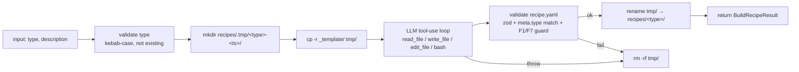

# meta/ — メタエージェント層

## 概要

**エージェント自身がレシピを増殖させる** ための層。現状 `recipe-builder.ts` のみ。

## 提供機能

| モジュール                 | 責務                                                                                                                       |
| -------------------------- | -------------------------------------------------------------------------------------------------------------------------- |
| `recipe-builder.ts`        | 自然言語の種別記述から動作するレシピ一式 (`recipes/<type>/*`) を生成・検証。**アトミック rename** で commit / ロールバック |
| `recipe-builder-prompt.md` | Recipe Builder の system prompt。Common preamble に追加される（prompt caching 対象）                                       |

## `buildRecipe()` の動作



### アトミック rollback（方針 a）

失敗時は tmp ディレクトリを削除して `recipes/<type>/` は存在しないまま。成功時だけ rename で commit されるので **「存在 = 完成品」の不変条件** を維持。

- tmp 位置: `<repoRoot>/recipes/.tmp/<type>-<timestamp>/`（クロス FS rename 失敗回避のためレポ内に配置、`.gitignore` 済み）
- rename は同一 FS 上でアトミック

### 検証で自動的に落とす条件

- recipe.yaml が存在しない・パース不可
- zod スキーマに合致しない
- `meta.type` が入力の `type` と不一致
- `scaffold.type: 'template'` で `<scaffold.path>/package.json` が欠落
- README.md が欠落
- `build.command` / `test.command` に `--ignore-workspace` が含まれていない（F1 ガード）

## 使い方

```bash
pnpm tsx scripts/add-recipe.ts --type cli --description "Node.js CLI ツール（commander + vitest）"
```

オプション:

- `--budget-usd 0.50` — 情報表示用。実行は mid-call では止まらないが終了時に超過を警告
- `--model claude-sonnet-4-6` — Builder に使うモデルを明示（既定は Sonnet 4.6）
- `--max-rounds 30` — tool-use ラウンド上限

プログラム的にも呼べます:

```ts
import { buildRecipe } from './meta/recipe-builder';

const result = await buildRecipe({
  type: 'my-stack',
  description: '...',
  repoRoot: process.cwd(),
});
console.log(result.recipePath, result.toolCalls, result.usage);
```

## 実動作実績（2026-04-22 / Phase 5）

| 指標       | 値                                                            |
| ---------- | ------------------------------------------------------------- |
| 対象       | `cli` (Node.js CLI, commander + vitest)                       |
| 所要時間   | 220 s                                                         |
| LLM モデル | claude-sonnet-4-6                                             |
| LLM calls  | 29 rounds                                                     |
| tool calls | 33 (list_dir=3 read_file=3 write_file=14 bash=13 うち 4 失敗) |
| tokens     | in=54,207 out=11,655 **cacheR=396,901** cacheW=23,180         |
| コスト     | **$0.5434**（budget $1.00 内）                                |

生成されたレシピで `scripts/run.ts --recipe cli --request "hello を出力する CLI"` を実行し、programmer が npm install + tsc + vitest を成功させて **実働する CLI コード** を生成する end-to-end 動作も確認済み。

## 既知の改善点

recipe-builder が生成する `recipe.yaml` の `build.command` / `test.command` に、稀に `pnpm install` 相当が欠落することがある（Phase 5 で 1 件観測、手動パッチで修正）。次回改善案:

- recipe-builder-prompt.md で「build.command は必ず `pnpm install ... && ...` で始めること」を強調
- `validateBuiltRecipe` に「build.command 内に `install` を含むこと」の soft check を追加

## 変更履歴

- 2026-04-21: 初版スタブ
- 2026-04-22 (Phase 5): `recipe-builder.ts` 実装。アトミック rollback（方針 a）、Claude SDK 直接呼び出し、scoped file tools、prompt caching、zod 検証、F1/F7 ガード、CLI 実運転で `cli` レシピ自動生成（$0.54）+ 生成レシピの end-to-end 実動 ($0.40) を確認。
